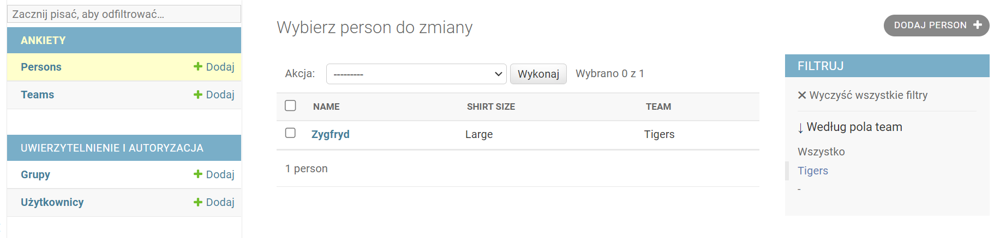

# Aplikacje WWW, semestr 2024Z

## Lab 5
---
#### **1. Klasa QuerySet i dostępne metody:**
https://docs.djangoproject.com/pl/4.2/ref/models/querysets/

Django ORM korzysta z obiektów `QuerySet` do wykonywania zapytań do bazy danych. `QuerySet` reprezentuje kolekcję obiektów modelu i pozwala na ich filtrowanie, sortowanie oraz manipulowanie danymi. Poniżej znajdziesz przegląd najczęściej używanych metod `QuerySet`, ich zastosowanie i przykłady.

### 1. **`all()`**
   - Zwraca wszystkie obiekty modelu.
   - **Przykład**:
     ```python
     from myapp.models import Product
     products = Product.objects.all()
     ```

### 2. **`filter(**kwargs)`**
   - Zwraca obiekty spełniające podane kryteria.
   - **Przykład**:
     ```python
     active_products = Product.objects.filter(is_active=True)
     ```

### 3. **`exclude(**kwargs)`**
   - Zwraca obiekty, które nie spełniają podanych kryteriów.
   - **Przykład**:
     ```python
     inactive_products = Product.objects.exclude(is_active=True)
     ```

### 4. **`get(**kwargs)`**
   - Zwraca jeden obiekt spełniający podane kryteria. Podnosi wyjątek `DoesNotExist`, jeśli obiekt nie istnieje, lub `MultipleObjectsReturned`, jeśli istnieje więcej niż jeden.
   - **Przykład**:
     ```python
     product = Product.objects.get(id=1)
     ```

### 5. **`count()`**
   - Zwraca liczbę obiektów w `QuerySet`.
   - **Przykład**:
     ```python
     number_of_products = Product.objects.filter(is_active=True).count()
     ```

### 6. **`exists()`**
   - Sprawdza, czy `QuerySet` zawiera jakiekolwiek obiekty (zwraca `True` lub `False`).
   - **Przykład**:
     ```python
     has_active_products = Product.objects.filter(is_active=True).exists()
     ```

### 7. **`order_by(*fields)`**
   - Sortuje obiekty według podanych pól. Dodaj `-` przed nazwą pola, aby sortować malejąco.
   - **Przykład**:
     ```python
     sorted_products = Product.objects.order_by('price')
     ```

### 8. **`distinct()`**
   - Zwraca unikalne obiekty w `QuerySet`.
   - **Przykład**:
     ```python
     unique_categories = Product.objects.values('category').distinct()
     ```

### 9. **`values(*fields)`**
   - Zwraca `QuerySet` słowników, z wartościami tylko dla podanych pól.
   - **Przykład**:
     ```python
     product_names = Product.objects.values('name')
     ```

### 10. **`values_list(*fields, flat=False)`**
   - Zwraca `QuerySet` list wartości dla podanych pól. Użyj `flat=True`, aby otrzymać jednowymiarową listę dla jednego pola.
   - **Przykład**:
     ```python
     product_prices = Product.objects.values_list('price', flat=True)
     ```

### 11. **`annotate(*args, **kwargs)`**
   - Dodaje dodatkowe pole do obiektów w `QuerySet`, które wykonuje agregację.
   - **Przykład**:
     ```python
     from django.db.models import Count
     categories = Product.objects.values('category').annotate(num_products=Count('id'))
     ```

### 12. **`aggregate(**kwargs)`**
   - Zwraca słownik z wynikami agregacji na poziomie całego `QuerySet`.
   - **Przykład**:
     ```python
     from django.db.models import Sum
     total_price = Product.objects.aggregate(Sum('price'))
     ```

### 13. **`first()`**
   - Zwraca pierwszy obiekt w `QuerySet` lub `None`, jeśli `QuerySet` jest pusty.
   - **Przykład**:
     ```python
     first_product = Product.objects.all().first()
     ```

### 14. **`last()`**
   - Zwraca ostatni obiekt w `QuerySet` lub `None`, jeśli `QuerySet` jest pusty.
   - **Przykład**:
     ```python
     last_product = Product.objects.all().last()
     ```

### 15. **`slice()`**
   - Umożliwia używanie indeksów do uzyskiwania podzbiorów z `QuerySet`.
   - **Przykład**:
     ```python
     some_products = Product.objects.all()[0:10]  # Pierwsze 10 produktów
     ```

### 16. **`select_related(*fields)`**
   - Umożliwia pobieranie powiązanych obiektów w tym samym zapytaniu, co poprawia wydajność w przypadku relacji `ForeignKey` i `OneToOneField`.
   - **Przykład**:
     ```python
     products = Product.objects.select_related('category').all()
     ```

### 17. **`prefetch_related(*fields)`**
   - Umożliwia pobieranie powiązanych obiektów w oddzielnym zapytaniu, co poprawia wydajność w przypadku relacji `ManyToManyField` i `reverse ForeignKey`.
   - **Przykład**:
     ```python
     categories = Category.objects.prefetch_related('products').all()
     ```

### 18. **`update(**kwargs)`**
   - Umożliwia aktualizację wielu obiektów w `QuerySet` za pomocą jednego zapytania.
   - **Przykład**:
     ```python
     Product.objects.filter(is_active=True).update(price=F('price') * 1.1)  # Zwiększa cenę o 10%
     ```

### 19. **`delete()`**
   - Usuwa obiekty z bazy danych. Zwraca liczbę usuniętych obiektów oraz słownik informacyjny.
   - **Przykład**:
     ```python
     deleted_count, _ = Product.objects.filter(is_active=False).delete()
     ```

### 20. **`iterator()`**
   - Umożliwia iterowanie przez `QuerySet`, co jest przydatne w przypadku dużych zbiorów danych.
   - **Przykład**:
     ```python
     for product in Product.objects.iterator():
         print(product.name)
     ```

### 21. **`using(db_alias)`**
   - Umożliwia wykonanie zapytań na konkretnej bazie danych, jeśli masz skonfigurowane wiele baz danych.
   - **Przykład**:
     ```python
     products = Product.objects.using('secondary_db').all()
     ```

### 22. **`reverse()`**
   - Odwraca kolejność obiektów w `QuerySet`.
   - **Przykład**:
     ```python
     reversed_products = Product.objects.all().reverse()
     ```

### 23. **`defer(*fields)`**
   - Opóźnia pobieranie wartości dla podanych pól do momentu, gdy będą one potrzebne, co może poprawić wydajność.
   - **Przykład**:
     ```python
     products = Product.objects.defer('description').all()  # Opóźnia pobieranie 'description'
     ```

### 24. **`only(*fields)`**
   - Pobiera tylko podane pola z bazy danych, co może poprawić wydajność.
   - **Przykład**:
     ```python
     products = Product.objects.only('name', 'price').all()  # Pobiera tylko 'name' i 'price'
     ```

### 25. **`get_or_create(**kwargs)`**
   - Zwraca krotkę (obiekt, utworzone) lub zwraca istniejący obiekt, jeśli już istnieje.
   - **Przykład**:
     ```python
     product, created = Product.objects.get_or_create(name='New Product', defaults={'price': 10.0})
     ```

### 26. **`bulk_create(objs, batch_size=None)`**
   - Umożliwia szybkie tworzenie wielu obiektów w jednym zapytaniu.
   - **Przykład**:
     ```python
     products = [Product(name='Product 1'), Product(name='Product 2')]
     Product.objects.bulk_create(products)
     ```

### 27. **`bulk_update(objs, fields)`**
   - Umożliwia szybkie aktualizowanie wielu obiektów w jednym zapytaniu.
   - **Przykład**:
     ```python
     products = Product.objects.all()
     for product in products:
         product.price += 1.0
     Product.objects.bulk_update(products, ['price'])
     ```

### 28. **`update_or_create(**kwargs)`**
   - Umożliwia aktualizowanie istniejącego obiektu lub tworzenie nowego, jeśli obiekt nie istnieje.
   - **Przykład**:
     ```python
     product, created = Product.objects.update_or_create(
         name='Existing Product',
         defaults={'price': 20.0}
     )
     ```

Metody `QuerySet` w Django ORM są potężne i elastyczne, umożliwiając łatwe manipulowanie danymi w bazie danych. Wybór odpowiednich metod może znacząco poprawić wydajność aplikacji.

### **2 Przesłanianie metod oraz właściwości META.**  

W Django istnieją dwa kluczowe mechanizmy konfiguracyjne dla modeli: **przesłanianie metod** oraz **konfiguracja właściwości `Meta`**. Każdy z nich umożliwia modyfikację zachowania modeli, choć działają na różnych poziomach:

1. **Przesłanianie metod** – umożliwia nadpisywanie metod klasy `Model`, aby dostosować logikę działania konkretnych operacji.
2. **Klasa Meta** – dostarcza zestaw opcji konfiguracyjnych, które wpływają na sposób działania modelu, takich jak jego nazwa, kolejność, uprawnienia, a także zachowanie w relacji z innymi modelami.

#### 2.1. Przesłanianie metod

Przesłanianie (lub nadpisywanie) metod to proces redefiniowania metod w modelu, aby zmienić domyślne zachowanie. Django oferuje kilka metod, które można przesłonić w celu dostosowania działania modeli:

#### a) `save(self, *args, **kwargs)`

Metoda `save` służy do zapisania instancji modelu w bazie danych. Przesłaniając ją, można zmienić sposób zapisywania obiektu, dodać walidację czy dodatkową logikę.

**Przykład**:

```python
from django.db import models

class MyModel(models.Model):
    name = models.CharField(max_length=50)
    slug = models.SlugField(unique=True)

    def save(self, *args, **kwargs):
        # Wygenerowanie unikalnego slugu na podstawie nazwy
        if not self.slug:
            self.slug = self.name.replace(" ", "-").lower()
        super().save(*args, **kwargs)
```

W tym przypadku, jeśli nie ustawiono `slug`, zostanie on wygenerowany automatycznie na podstawie `name`.

#### b) `delete(self, *args, **kwargs)`

`delete` usuwa instancję modelu z bazy danych. Możemy przesłonić ją, aby przed usunięciem obiektu wykonać dodatkowe działania.

**Przykład**:

```python
class MyModel(models.Model):
    name = models.CharField(max_length=50)

    def delete(self, *args, **kwargs):
        print(f"Usuwam obiekt: {self.name}")
        super().delete(*args, **kwargs)
```

Przed usunięciem obiektu `delete` wyświetli wiadomość w konsoli.

#### c) `__str__(self)`

`__str__` odpowiada za tekstową reprezentację obiektu. Jest szczególnie przydatna w panelu administracyjnym.

**Przykład**:

```python
class MyModel(models.Model):
    name = models.CharField(max_length=50)

    def __str__(self):
        return f"MyModel: {self.name}"
```

Dzięki temu, kiedy wywołamy `print(my_instance)`, zwróci czytelną nazwę zamiast domyślnej reprezentacji obiektu.

#### d) `get_absolute_url(self)`

Metoda `get_absolute_url` zwraca pełny adres URL do konkretnego obiektu. Jest często wykorzystywana w szablonach.

**Przykład**:

```python
from django.urls import reverse

class MyModel(models.Model):
    name = models.CharField(max_length=50)

    def get_absolute_url(self):
        return reverse("my_model_detail", args=[str(self.id)])
```

#### 2.2. Właściwości `Meta`

Klasa wewnętrzna `Meta` zawiera opcje konfiguracyjne modelu, które wpływają na zachowanie i charakterystykę całego modelu.

```python
class MyModel(models.Model):
    name = models.CharField(max_length=50)

    class Meta:
        ordering = ['name']
        verbose_name = "My Model"
        verbose_name_plural = "My Models"
```

#### Kluczowe właściwości `Meta`:

- **`ordering`**: Definiuje domyślną kolejność obiektów, gdy są pobierane z bazy danych.

  ```python
  class Meta:
      ordering = ['name']  # Ascending order
      # ordering = ['-name']  # Descending order
  ```

- **`verbose_name` i `verbose_name_plural`**: Nazwa, która będzie wyświetlana w interfejsie administracyjnym Django. `verbose_name_plural` służy do zdefiniowania liczby mnogiej.

  ```python
  class Meta:
      verbose_name = "Produkt"
      verbose_name_plural = "Produkty"
  ```

- **`db_table`**: Umożliwia ustawienie niestandardowej nazwy tabeli w bazie danych.

  ```python
  class Meta:
      db_table = 'custom_table_name'
  ```

- **`unique_together`** *(zostało zastąpione przez `UniqueConstraint` w Django 2.2)*: Zapewnia unikalność kombinacji dwóch lub więcej pól.

  ```python
  class Meta:
      unique_together = ('first_name', 'last_name')
  ```

- **`constraints`**: Pozwala definiować bardziej złożone ograniczenia na poziomie bazy danych, np. warunki `UNIQUE`, `CHECK` i `FOREIGN KEY`.

  ```python
  from django.db.models import Q, UniqueConstraint
  
  class Meta:
      constraints = [
          UniqueConstraint(fields=['first_name', 'last_name'], name='unique_full_name'),
          models.CheckConstraint(check=Q(price__gte=0), name='price_gte_0'),
      ]
  ```

- **`permissions`**: Definiuje dodatkowe uprawnienia, które można przypisać użytkownikom.

  ```python
  class Meta:
      permissions = [
          ("can_view_secret_data", "Can view secret data"),
      ]
  ```

- **`abstract`**: Ustawienie modelu jako modelu abstrakcyjnego, co oznacza, że Django nie utworzy dla niego tabeli. Taki model może być bazą do dziedziczenia w innych modelach.

  ```python
  class Meta:
      abstract = True
  ```

- **`default_related_name`**: Ustawia domyślną nazwę relacji odwrotnej dla `ForeignKey`, `ManyToManyField` lub `OneToOneField`.

  ```python
  class Meta:
      default_related_name = 'related_model'
  ```

### Przykład wykorzystania Meta i nadpisania metod w jednym modelu

```python
from django.db import models
from django.urls import reverse
from django.db.models import Q

class Product(models.Model):
    name = models.CharField(max_length=100)
    price = models.DecimalField(max_digits=10, decimal_places=2)
    stock = models.IntegerField()

    def save(self, *args, **kwargs):
        # Ustal minimalną cenę przed zapisem
        if self.price < 0:
            raise ValueError("Cena produktu nie może być ujemna.")
        super().save(*args, **kwargs)

    def get_absolute_url(self):
        return reverse("product_detail", args=[str(self.id)])

    def __str__(self):
        return self.name

    class Meta:
        ordering = ['name']
        verbose_name = "Produkt"
        verbose_name_plural = "Produkty"
        constraints = [
            models.CheckConstraint(check=Q(price__gte=0), name='price_gte_0')
        ]
```

W powyższym modelu:
- W `save` zapewniamy, że cena nie jest ujemna.
- `get_absolute_url` zwraca URL szczegółowy produktu.
- `Meta` definiuje domyślną kolejność, nazwę wyświetlaną i ograniczenie `price_gte_0`, które gwarantuje, że cena zawsze będzie większa lub równa zero.

#### **3 Modyfikacja listy pól w widoku listy i filtry w module admin**

W panelu administracyjnym dla obiektów `Osoba` nie są widoczne wszystkie pola na liście wszystkich obiektów lecz tylko jedno z nich. Aby to zrobić należy najpierw zdefiniować w pliku `admin.py` klasę admin dla danego modelu, a następnie zadeklarować pole do wyświetlenia w zmiennej `list_display`. Przykład poniżej:

**_Listing 2_**
```python
class PersonAdmin(admin.ModelAdmin):
    # zmienna list_display przechowuje listę pól, które mają się wyświetlać w widoku listy danego modelu w panelu administracynym
    list_display = ['name', 'shirt_size']

# ten obiekt też trzeba zarejestrować w module admin
admin.site.register(Person, PersonAdmin)
```

W panelu administracyjnym możliwe jest również dodanie filtrów do widoków. Cały proces polega na dodaniu pola `filter_list` w klasie admin danego modułu:

**_Listing 3_**
```python
# przykład i wizualizacja dla modeli Person oraz Team.

class PersonAdmin(admin.ModelAdmin):
    list_filter = ('team')
```

 

W zależności od typu pola zostanie wyświetlony odpowiedni filtr. W przypadku niektórych rodzajów i dużej liczby unikalnych wartości używanie filtrów może być niepraktyczne ze względów wydajnościowych i wizualnych.

# **Zadania** 

**Zadanie 5**  
Przesłoń metodę `__str__()` modelu `Osoba` tak aby zamiast `Osoba object #` wyświetlane było imię i nazwisko osoby.

**Zadanie 6**  
Bazując na przykładzie z dokumentacji https://docs.djangoproject.com/pl/4.2/topics/db/models/#meta-options dodaj właściwość `META` sortując domyślnie po nazwisku rosnąco (alfabetycznie).

**Zadanie 7**  
Dodaj odpowiednią klasę `ModelAdmin` dla modelu `Osoba` i zmień listę wyświetlanych kolumn w panelu administracyjnym.

**Zadanie 8**  
Zmodyfikuj kod aplikacji tak, żeby na liście modeli `Osoba` w panelu administracyjnym wyświetlana została również kolumna `Stanowisko` o postaci 'Stanowisko (id)' np. `księgowa (1)`. Podpowiedź: sprawdź w dokumentacji modułu admin opis działania adnotacji `@admin.display`.

**Zadanie 9**  
Dodaj filtr dla stanowisk oraz daty utworzenia dla klasy `Osoba` oraz dla nazw dla klasy `Stanowisko`. Przetestuj działanie filtrów.

**Zadanie 10**  
Korzystając z dokumentacji API klasy QuerySet z pkt. 3 wykonaj następujące zapytania za pomocą shella Django (**kod Pythona z zapytaniami umieść w pliku lab_3_zadanie_10.md w swoim repozytorium**):
* wyświetl wszystkie obiekty modelu `Osoba`,
* wyświetl obiekt modelu `Osoba` z id = 3,
* wyświetl obiekty modelu `Osoba`, których nazwa rozpoczyna się na wybraną przez Ciebie literę alfabetu (tak, żeby był co najmniej jeden wynik),
* wyświetl unikalną listę stanowisk przypisanych dla modeli `Osoba`,
* wyświetl nazwy stanowisk posortowane alfabetycznie malejąco,
* dodaj nową instancję obiektu klasy `Osoba` i zapisz w bazie.

**Zadanie 11**  
Jeżeli nie robiłeś/-aś tego wcześniej to zatwierdź wszystkie zmiany w danym branchu i spróbuj wykonać merge z główną gałęzią. Proponuję wykonać tę operację przy pomocy interfejsu IDE PyCharm, aby przetestować wbudowane narzędzie do wspomagania procesu merge (o ile wystąpią konflikty).

**Dla chętnych**  
Podobne zagadnienia zostały przedstawione w oficjalnym tutorialu numer 7: https://docs.djangoproject.com/pl/4.2/intro/tutorial07/. Przejrzyj je i spróbuj wybrane rozwiązania zastosować w kodzie z zajęć.