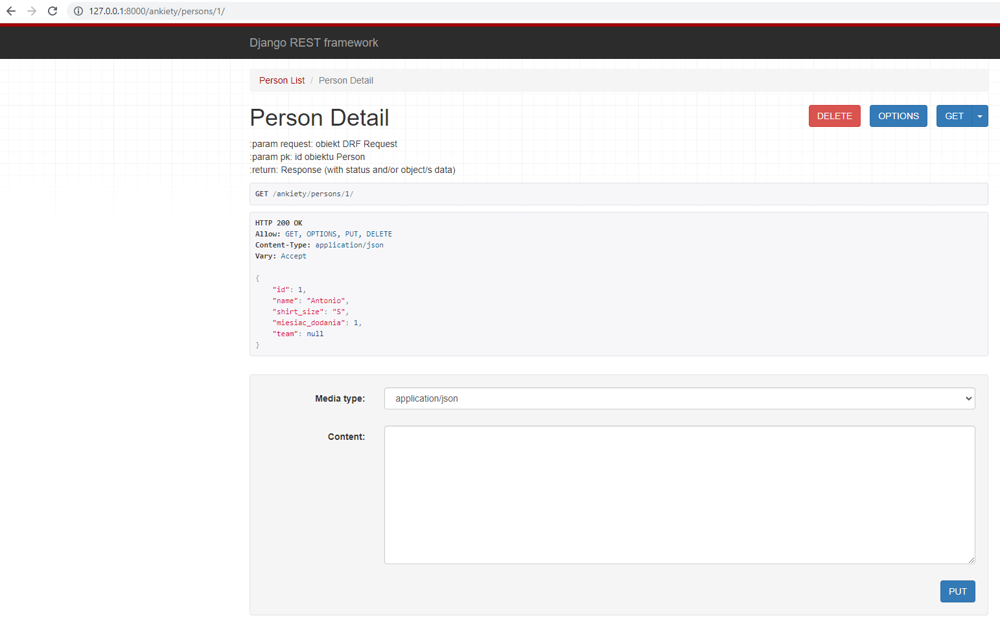

# Aplikacje WWW, semestr 2024Z

## Lab 7 - Podstawowa walidacja wewnątrz serializerów danych oraz budowa pierwszych endpoint'ów REST API.
---

### **1. Walidacja danych w procesie serializacji.**

#### **1.1 Walidacja na poziomie pojedynczego pola.**

Oprócz automatycznej walidacji wartości pól na podstawie wybranego typu pola (numeryczne, tekstowe, daty itd.) możliwe jest również zdefiniowanie reguł walidacji, które są nieco bardziej złożone lub specyficzne dla danego problemu biznesowego. Aby automatycznie przypisać taki walidator dla konkretnego pola musimy jego nazwę zdefiniowac wg. wzorca `.validate_<nazwa_pola>` wewnątrz serializera. Metoda ta przyjmuje pojedynczy argument, który jest wartością pola, które ma zostać poddana walidacji. Ta metoda zwraca zwalidowaną wartość pola lub zgłasza wyjątek `serializers.ValidationError`. Przykład poniżej.

**_Listing 1_**
```python
# fragment klasy PersonSerializer

# walidacja wartości pola name
    def validate_name(self, value):

        if not value.istitle():
            raise serializers.ValidationError(
                "Nazwa osoby powinna rozpoczynać się wielką literą!",
            )
        return value
```

Jeżeli walidacja danego pola nie powiedzie się to zmienna `.errors` przechowa stosowny komunikat o błędzie i nie pozwoli na zapisanie obiektu przed usunięciem wszystkich błędów.

#### **1.2 Walidacja na poziomie obiektu.**

Walidacja na poziomie obiektu jest potrzebna, kiedy niezbędne jest wykorzystanie dostępu do wielu pól. Przykład (z oficjalnej dokumentacji) poniżej.

**_Listing 2_**
```python
class EventSerializer(serializers.Serializer):
    description = serializers.CharField(max_length=100)
    start = serializers.DateTimeField()
    finish = serializers.DateTimeField()

    def validate(self, data):
        """
        Check that start is before finish.
        """
        if data['start'] > data['finish']:
            raise serializers.ValidationError("finish must occur after start")
        return data
```

#### **1.3 Własne i wbudowane walidatory.**

W przypadku gdy nasze reguły walidacji (oprócz już tych wbudowanych we frameworku) trzeba wykorzystać w wielu polach i wielu serializerach, najlepszym pomysłem jest zdefiniować je jako zewnętrzne funkcje lub obiekty. Można to zrobić wewnątrz pliku z kodem serializerów, ale jeszcze lepszym pomysłem będzie wyniesienie ich do oddzielnego modułu (pliku). Poniżej przykład dla pierwszego przypadku (również z oficjalnej dokumentacji DRF).

**_Listing 3_**
```python
# metoda walidująca, można stworzyć oddzielny moduł z wieloma takimi metodami 
# i zaimportować w różnych miejscach projektu
def multiple_of_ten(value):
    if value % 10 != 0:
        raise serializers.ValidationError('Not a multiple of ten')

class GameRecord(serializers.Serializer):
    score = IntegerField(validators=[multiple_of_ten])
    ...
```

DRF posiada również wbudowane walidatory, które mogą służyć do walidacji np. unikalności wartości w danym zbiorze (np. tabeli w bazie danych). Przykład jego wykorzystania poniżej.

**_Listing 4_**
```python
class EventSerializer(serializers.Serializer):
    name = serializers.CharField()
    room_number = serializers.IntegerField(choices=[101, 102, 103, 201])
    date = serializers.DateField()

    class Meta:
        # Each room only has one event per day.
        validators = [
            UniqueTogetherValidator(
                queryset=Event.objects.all(),
                fields=['room_number', 'date']
            )
        ]
```

Django oferuje wiele wbudowanych walidatorów (Lista oraz przykłady wykorzystania tych walidatorów znajdują się w dokumentacji pod adresem: https://www.django-rest-framework.org/api-guide/validators/), które pomagają w zapewnieniu, że dane wprowadzone przez użytkowników są zgodne z określonymi regułami i standardami. Oto lista niektórych z najpopularniejszych walidatorów, ich zastosowanie oraz przykłady użycia:

### 1. `MaxLengthValidator`
- **Opis**: Sprawdza, czy długość pola nie przekracza określonej wartości.
- **Przykład użycia**:
  ```python
  from django.core.validators import MaxLengthValidator
  from django.db import models

  class ExampleModel(models.Model):
      name = models.CharField(max_length=100, validators=[MaxLengthValidator(50)])
  ```

### 2. `MinLengthValidator`
- **Opis**: Sprawdza, czy długość pola jest większa lub równa określonej wartości.
- **Przykład użycia**:
  ```python
  from django.core.validators import MinLengthValidator
  from django.db import models

  class ExampleModel(models.Model):
      username = models.CharField(max_length=30, validators=[MinLengthValidator(5)])
  ```

### 3. `EmailValidator`
- **Opis**: Sprawdza, czy wartość pola jest poprawnym adresem e-mail.
- **Przykład użycia**:
  ```python
  from django.core.validators import EmailValidator
  from django.db import models

  class ExampleModel(models.Model):
      email = models.EmailField(validators=[EmailValidator()])
  ```

### 4. `URLValidator`
- **Opis**: Sprawdza, czy wartość pola jest poprawnym adresem URL.
- **Przykład użycia**:
  ```python
  from django.core.validators import URLValidator
  from django.db import models

  class ExampleModel(models.Model):
      website = models.CharField(max_length=200, validators=[URLValidator()])
  ```

### 5. `RegexValidator`
- **Opis**: Umożliwia walidację pola przy użyciu wyrażenia regularnego.
- **Przykład użycia**:
  ```python
  from django.core.validators import RegexValidator
  from django.db import models

  class ExampleModel(models.Model):
      phone_number = models.CharField(
          max_length=15,
          validators=[RegexValidator(regex=r'^\+?1?\d{9,15}$')]
      )
  ```

### 6. `MinValueValidator`
- **Opis**: Sprawdza, czy wartość pola jest większa lub równa określonej wartości minimalnej.
- **Przykład użycia**:
  ```python
  from django.core.validators import MinValueValidator
  from django.db import models

  class ExampleModel(models.Model):
      age = models.IntegerField(validators=[MinValueValidator(18)])
  ```

### 7. `MaxValueValidator`
- **Opis**: Sprawdza, czy wartość pola nie przekracza określonej wartości maksymalnej.
- **Przykład użycia**:
  ```python
  from django.core.validators import MaxValueValidator
  from django.db import models

  class ExampleModel(models.Model):
      rating = models.IntegerField(validators=[MaxValueValidator(5)])
  ```

### 8. `ValidationError`
- **Opis**: Umożliwia zdefiniowanie własnych warunków walidacji i zgłaszanie błędów, gdy warunki nie są spełnione.
- **Przykład użycia**:
  ```python
  from django.core.exceptions import ValidationError
  from django.db import models

  def validate_even(value):
      if value % 2 != 0:
          raise ValidationError(f'{value} is not an even number.')

  class ExampleModel(models.Model):
      even_number = models.IntegerField(validators=[validate_even])
  ```

### 9. `FileExtensionValidator`
- **Opis**: Sprawdza, czy rozszerzenie pliku jest dozwolone.
- **Przykład użycia**:
  ```python
  from django.core.validators import FileExtensionValidator
  from django.db import models

  class ExampleModel(models.Model):
      file = models.FileField(validators=[FileExtensionValidator(allowed_extensions=['pdf', 'docx'])])
  ```

### 10. `BooleanValidator`
- **Opis**: Sprawdza, czy wartość pola jest wartością logiczną.
- **Przykład użycia**:
  ```python
  from django.core.validators import BooleanValidator
  from django.db import models

  class ExampleModel(models.Model):
      is_active = models.BooleanField(validators=[BooleanValidator()])
  ```

### 11. `MaxLengthValidator`
- **Opis**: Waliduje maksymalną długość pola tekstowego.
- **Przykład użycia**:
  ```python
  from django.core.validators import MaxLengthValidator
  from django.db import models

  class ExampleModel(models.Model):
      description = models.CharField(max_length=255, validators=[MaxLengthValidator(100)])
  ```

### **2. Wykorzystanie widoków APIView do tworzenia endpointów REST API.**

REST API (Representational State Transfer Application Programming Interface) to styl architektoniczny używany do projektowania interfejsów API, który opiera się na protokole HTTP. REST opiera się na kilku zasadach, które zapewniają prostotę, skalowalność i łatwość użycia. Poniżej znajduje się opis podstawowych zasad oraz najczęściej używanych metod żądań w REST API.

### Zasady REST API

1. **Stateless**: Każde żądanie do serwera musi zawierać wszystkie informacje potrzebne do jego zrozumienia. Serwer nie przechowuje stanu klienta między różnymi żądaniami. To oznacza, że każde żądanie jest niezależne od innych.

2. **Użycie HTTP**: REST API wykorzystuje standardowe metody HTTP, co umożliwia korzystanie z różnych protokołów i narzędzi do komunikacji.

3. **Zasoby**: W REST API zasoby są identyfikowane przez unikalne identyfikatory URI (Uniform Resource Identifier). Zasoby mogą być reprezentowane w różnych formatach, najczęściej jako JSON lub XML.

4. **Interfejs uniformny**: REST API posiada jednolity interfejs, co oznacza, że komunikacja odbywa się w określony sposób, co ułatwia zrozumienie i implementację.

5. **Klient-serwer**: Architektura REST oddziela klienta od serwera, co umożliwia niezależny rozwój obu komponentów.

6. **Cache**: Odpowiedzi z serwera mogą być buforowane, co przyspiesza działanie aplikacji i zmniejsza obciążenie serwera.

### Metody żądań w REST API

REST API korzysta z różnych metod HTTP do wykonywania operacji na zasobach. Oto najpopularniejsze metody:

1. **GET**:
   - **Opis**: Służy do pobierania zasobów z serwera.
   - **Przykład użycia**: `GET /api/books/` - pobiera listę wszystkich książek.

2. **POST**:
   - **Opis**: Używana do tworzenia nowych zasobów na serwerze.
   - **Przykład użycia**: `POST /api/books/` z danymi książki w ciele żądania, co tworzy nową książkę.

3. **PUT**:
   - **Opis**: Używana do aktualizacji istniejących zasobów. Zazwyczaj wysyła wszystkie dane zasobu, nawet te, które się nie zmieniają.
   - **Przykład użycia**: `PUT /api/books/1/` z danymi aktualizowanej książki w ciele żądania.

4. **PATCH**:
   - **Opis**: Używana do częściowej aktualizacji zasobu. Wysyła tylko te dane, które mają zostać zmienione.
   - **Przykład użycia**: `PATCH /api/books/1/` z danymi, które mają być zmienione.

5. **DELETE**:
   - **Opis**: Służy do usuwania zasobów z serwera.
   - **Przykład użycia**: `DELETE /api/books/1/` - usuwa książkę o identyfikatorze 1.

### Przykłady żądań REST API

Oto kilka przykładów żądań, które można wysłać do REST API:

- **Pobranie wszystkich książek**:
  ```http
  GET /api/books/
  ```

- **Pobranie konkretnej książki**:
  ```http
  GET /api/books/1/
  ```

- **Utworzenie nowej książki**:
  ```http
  POST /api/books/
  Content-Type: application/json

  {
      "title": "Django for Beginners",
      "author": "William S. Vincent",
      "published_date": "2021-01-01"
  }
  ```

- **Aktualizacja książki**:
  ```http
  PUT /api/books/1/
  Content-Type: application/json

  {
      "title": "Django for Beginners",
      "author": "William S. Vincent",
      "published_date": "2021-01-01"
  }
  ```

- **Częściowa aktualizacja książki**:
  ```http
  PATCH /api/books/1/
  Content-Type: application/json

  {
      "author": "W. S. Vincent"
  }
  ```

- **Usunięcie książki**:
  ```http
  DELETE /api/books/1/
  ```

> **Ważne: Aby skorzystać z widoków dla REST API dostarczanych z frameworkiem DRF należy w pliku `projekt\settings.py` dodać w `INSTALLED_APPS` wpis `rest_framework`.**

W odróżnienu od klasy `HttpRequest` z frameworka Django, DRF wykorzystuje rozszarzającą ją klasę `Request`, która jest lepiej przystosowana do obsługi żądań REST API. Wszelkie wartości takiego żądania znajdują się w zmiennej `request.data` w odróżnieniu od `request.POST` (klasa HttpRequest).
Do obsługi odpowiedzi wykorzystywana jest natomiast klasa `Response`, które w podstawowej formie zawiera wszelkie dane w surowej formie i dopiero w fazie negocjacji z klientem decyduje o ich postaci.

Chcąc stworzyć endpoint REST możemy wykorzystać dwa opakowania (ang. wrappers) z DRF:
* dekorator `@api_view` dla widoków opartych na funkcjach,
* klasę `APIView` dla widoków opartych na klasach.

Poniżej przykład implementacji endpointu opartego na widokach funkcyjnych (plik `views.py` wewnątrz struktury danej aplikacji.)

**_Listing 5_**
```python
from django.shortcuts import render
from rest_framework import status
from rest_framework.decorators import api_view
from rest_framework.response import Response
from .models import Person, Team
from .serializers import PersonSerializer

# określamy dostępne metody żądania dla tego endpointu
@api_view(['GET'])
def person_list(request):
    """
    Lista wszystkich obiektów modelu Person.
    """
    if request.method == 'GET':
        persons = Person.objects.all()
        serializer = PersonSerializer(persons, many=True)
        return Response(serializer.data)


@api_view(['GET', 'PUT', 'DELETE'])
def person_detail(request, pk):

    """
    :param request: obiekt DRF Request
    :param pk: id obiektu Person
    :return: Response (with status and/or object/s data)
    """
    try:
        person = Person.objects.get(pk=pk)
    except Person.DoesNotExist:
        return Response(status=status.HTTP_404_NOT_FOUND)

    """
    Zwraca pojedynczy obiekt typu Person.
    """
    if request.method == 'GET':
        person = Person.objects.get(pk=pk)
        serializer = PersonSerializer(person)
        return Response(serializer.data)

    elif request.method == 'PUT':
        serializer = PersonSerializer(person, data=request.data)
        if serializer.is_valid():
            serializer.save()
            return Response(serializer.data)
        return Response(serializer.errors, status=status.HTTP_400_BAD_REQUEST)

    elif request.method == 'DELETE':
        person.delete()
        return Response(status=status.HTTP_204_NO_CONTENT)

```

Teraz należy jeszcze w klasie serializera dodać implementację metody `update`, która jest wywoływana dla metody `PUT` dla endpointu `person_detail`.
Dobre praktyki jednak mówią o tym, że powinniśmy dla każdej operacji przygotować oddzielny ednpoint, co pozwoli też na lepszą granulację uprawnień w tak stworzonym systemie. Aby dodać metodę stworzenia nowego obiektu dla danego modelu możemy to zrobić dla metody `PUT` (chociaż dobre praktyki też mówią a tym, że powinien być używany do operacji UPDATE) lub lepiej przez metodę `POST`.

**_Listing 6_**
```python
    def update(self, instance, validated_data):
        instance.name = validated_data.get('name', instance.name)
        instance.shirt_size = validated_data.get('shirt_size', instance.shirt_size)
        instance.data_dodanie = validated_data.get('data_dodania', instance.miesiac_dodania)
        instance.stanowisko = validated_data.get('stanowisko', instance.team)
        instance.save()
        return instance
```

Aby całość zadziałała jak należy, niezbędne jest dodanie również odpowienich wpisów w plikach `urls.py` odpowiednich aplikacji projektu.

Przykład poniżej.

**_Listing 7_**
```python
# plik ankiety/urls.py

from django.urls import path, include
from . import views

urlpatterns = [
    path('persons/', views.person_list),
    path('persons/<int:pk>/', views.person_detail),
]
```

I przykładowy plik `projekt/urls.py` z importem url'i danej aplikacji.

**_Listing 8_**
```python
from django.contrib import admin
from django.urls import path, include


urlpatterns = [
    path('admin/', admin.site.urls),
    path('admin-tools/', include('admin_tools.urls'),),
    path('ankiety/', include('ankiety.urls'),)
]
```

Umieszczając definicje dla każdej aplikacji wewnątrz jej struktury, uniezależniamy ją jeszcze bardziej od głównego projektu i możemy łatwiej przenosić pomiędzy projektami. Wymagane jest jeszcze dołączenie tych urli w pliku `urls.py` głównego projektu.

Po poprawnej konfiguracji widok standardowy w oknie przeglądarki może wyglądać tak:




**Zadania**

1. Wykonaj zadania na nowym branchu o nazwie `feature_lab_5`. Na koniec pracy, po przetestowaniu, scal ten branch z główną gałęzią projektu.
2. Zmień implementację modelu `Osoba` tak, aby domyślną wartością pola `data_dodania` była data bieżąca. 
3. Dodaj również walidację dla klasy Osoba:
   * `nazwa` - może zawierać tylko litery,
   * `data_dodania` - nie może być z przyszłości (możliwe, że konieczne będzie zdjęcie właściwości pola tylko do odczytu).
4. Bazując na przykładach z bieżącego laboratorium przygotuj endpointy dla modeli `Osoba` i `Stanowisko`:
   * wyświetlanie, dodawanie i usuwanie pojedynczego obiektu typu `Osoba`,
   * wyświetlanie listy obiektów typu `Osoba`,
   * wyświetlenie listy obiektów typu `Osoba`, które zawierają w polu `nazwa` zadany łańcuch znaków,
   * wyświetlanie, dodawanie i usuwanie pojedynczego obiektu typu `Stanowisko`,
   * wyświetlanie listy obiektów typu `Stanowisko`.
5. Korzystając z posiadanego API (**NIE Z ADMIN PANELU**) wykonaj:
   * dodaj dwa nowe obiekty `Osoba` eksperymentując z różnymi polami,
   * zmodyfikuj jeden obiekt typu `Osoba`,
   * usuń jeden obiekt typu `Osoba`,
   * wyświetl wszystkie obiekty, które w nazwie zawierają literę `a`.
6. Do odpytania endpointów oprócz widoków serwowanych przez DRF wykorzystaj również program `Postman` (https://www.postman.com/downloads/) oraz polecenie `curl` (Dokumentacja: https://curl.se/docs/manual.html).
7. Bazując na przykładzie z dokumentacji pod adresem https://www.django-rest-framework.org/tutorial/3-class-based-views/ wykonaj:
   * zatwierdź zmiany w poprzednim branchu
   * dodaj nowy branch o nazwie `feature_lab_5_class_views` i przełącz się na niego
   * zamień implementację API dla modelu `Osoba` zgodnie z przykładem z dokumentacji, rozszerzając klasę `APIView` DRF, przetestuj działanie.
   * zatwierdź zmiany na branchu, ale nie scalaj z główną gałęzią.
