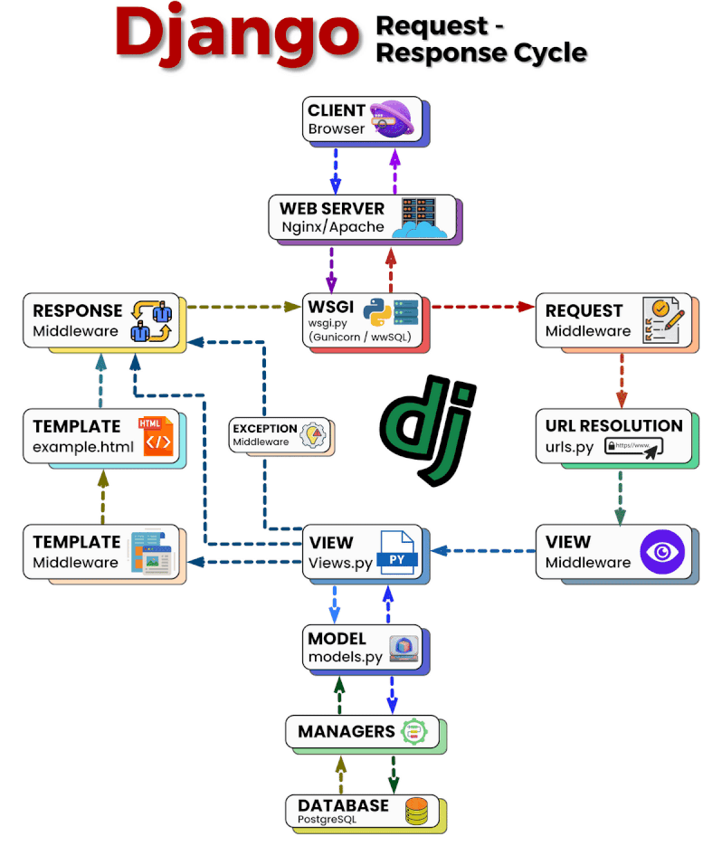
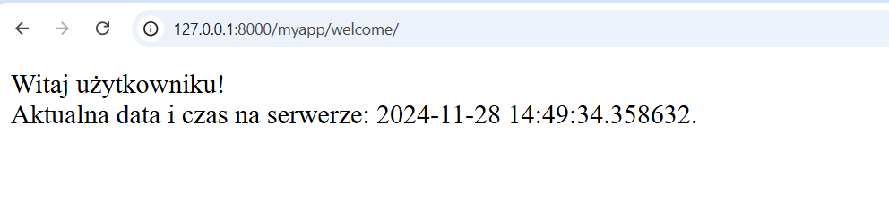
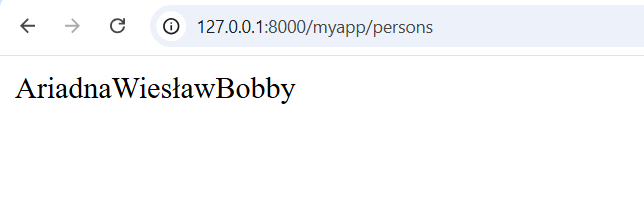
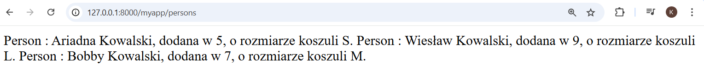
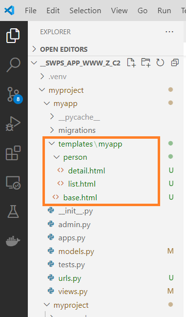
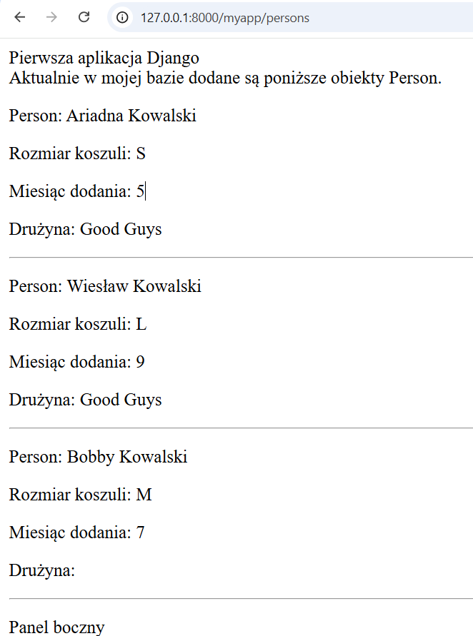
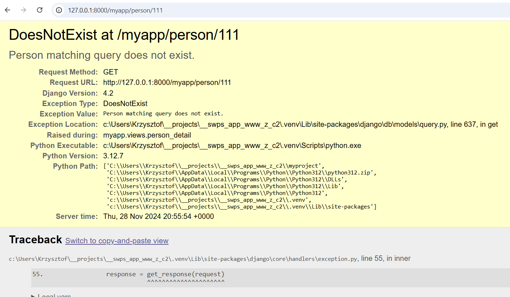
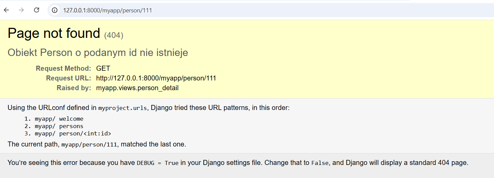

# Projektowanie aplikacji webowych, semestr 2024Z

## Lab 8 - Definiowanie widoków w aplikacji Django. Proste szablony stron.
---
### **1. Definiowanie widoków w aplikacji Django.**

> Dokumentacja dla widoków w Django: https://docs.djangoproject.com/pl/4.2/topics/http/views/


Widokiem nazywamy kawałek kodu, który odpowiada za przetworzenie konkretnego obiektu `żądania` i zwrócenie obiektu `odpowiedzi`. We frameworku Django w podstawowej jego odsłonie (można korzystać z rozszerzających go modułów, np. Django Rest Framework) będą to odpowiednio obiekty `HttpRequest` oraz `HttpResponse`. Obiekt żądania będzie zawierał adres URL (Uniform Resource Locator, zobacz: https://pl.wikipedia.org/wiki/Uniform_Resource_Locator), który będzie wskazywał w sposób jednoznaczny dla danego hosta gdzie żądane zasoby się znajdują (lub zwróci np. błąd 404, jeżeli takich zasobów na tym hoście nie zdefiniowano) oraz może zawierać również dodatkowe parametry nazywane parametrami żądania. Protokół HTTP definiuje wiele typów żądań np. `GET`,`POST`, `PUT`, `PATCH`, `DELETE` i inne. 

Zacznijmy od prostego widoku, tak aby zobaczyć jaką "drogę" pokonuje żądanie i w jaki sposób w Django określamy definicję widoku i adresu URL, który będzie uruchamiał logikę generowania tego widoku.

_**Listing 1**_

```python
# kod umieszczamy w pliku views.py wybranej aplikacji

from django.http import HttpResponse
import datetime


def welcome_view(request):
    now = datetime.datetime.now()
    html = f"""
        <html><body>
        Witaj użytkowniku! </br>
        Aktualna data i czas na serwerze: {now}.
        </body></html>"""
    return HttpResponse(html)
```

W powyższej funkcji, którą nazywamy tutaj również widokiem, obiektem, z który otrzymamy do obsługi jest obiekt `django.http.HttpRequest` czyli obiekt żądania, a zwracać (return) będziemy obiekt typu `django.http.HttpResponse`. Do zmiennej `now` zapisujemy bieżącą datę i czas i podstawiamy ją w naszym prostym szablonie strony w miejscu znacznika `{now}`, a następnie zmienną `html` przekazujemy jako argument do obiektu `HttpResponse`, który zostanie wysłany jako odpowiedź serwera do przeglądarki, z której to żądanie zostało wysłane. To nie musi być HTML, możemy tu przekazać sam tekst, obraz czy inny plik.

**Mamy definicję widoku, ale w jaki sposób w przeglądarce wskazać adres URL, który ten widok wywoła?**

Aby lepiej zrozumieć cały cykl prześledźmy go na poniższym schemacie:



źródło: https://medium.com/@praseeshprasee/django-request-response-cycle-explained-e3d707eed99c

Patrząc na schemat i kolejne kroki żądania od klienta (u nas przeglądarka www), żądanie trafia do serwera (u nas po uruchomieniu polecenia `python manage.py runserver` zostaje on uruchomiony na komputerze lokalnym, stąd adresy http://localhost lub http://127.0.0.1, które to adresy odpowiadają lokalnej maszynie), następnie żądanie (`REQUEST`) przekierowane jest do etapu `URL RESOLUTION` (plik urls.py), w którym póki co nie umieszczaliśmy jeszcze żadnego kodu. I to jest miejsce, w którym we frameworku Django zdefiniujemy reguły, które skierują żądania dla danego adresu URL do widoku, który stworzyliśmy w listingu 1. Okazuje się bowiem, że ze schematu wynika, że pozostałe części (views.py, `RESPONSE` i powrót do przeglądarki) już zdefiniowane są, więc brakuje zmapowania URL na widok.

Można zdefiniować wszystkie mapowania URL w głównym pliku `urls.py` (`myproject\urls.py`), ale biorąc pod uwagę modułową naturę projektu Django oraz możliwość rozrośnięcia się projektu do większych ilości widoków, takie podejście nie jest najlepszym rozwiązaniem. Tutaj mapowania URL na widoki będziemy wykonywać w plikach wewnątrz konkretnej aplikacji.

**Stwórzmy więc *(o ile już nie istnieje)* plik `myproject\myapp\urls.py`.**

Edytujemy plik `myapp\urls.py` w naszej aplikacji.

> Dokumentacja URL Dispatcher: https://docs.djangoproject.com/pl/4.2/topics/http/urls/

_**Listing 2**_
```python
from django.urls import path

# importujemy moduł views (plik views.py z tego samego katalogu co plik bieżący)
from . import views

# definiujemy zmienną urlpatterns, która jest listą mapowań adresów URL na nasze widoki
urlpatterns = [
    path("welcome", views.welcome_view),
]
```

To jeszcze nie wszystko. Ze względu na strukturę projektu Django i tego, że mamy jedne projekt, który może składać się z wielu aplikacji, każda z aplikacji może definiować mapowania adresów URL w swojej podprzestrzeni. Taka sytuacja występuje w naszym projekcie dla modułu `admin`, do którego dostajemy się poprzez podanie adresu `adres serwera\admin`, a później już kolejne adresy URL są "doklejane" do tego przedrostka. Ta definicja znajduje sie aktualnie w pliku `myproject\urls.py` i wygląda tak:

_**Listing 3**_
```python
from django.contrib import admin
from django.urls import path


urlpatterns = [
    path('admin/', admin.site.urls),
]
```

Chcemy aby nasze widoki zdefiniowane w aplikacji `myapp` również były widoczne, a przedrostek był postaci `adres serwera\myapp`. Modyfikujemy więc plik powyżej do postaci:

_**Listing 4**_
```python
from django.contrib import admin
from django.urls import include, path


urlpatterns = [
    path('myapp/', include('myapp.urls')), # dołączamy reguły url z pliku myapp\urls.py
    path('admin/', admin.site.urls),
]
```

Teraz możemy uruchomić nasz serwer i sprawdzić czy stworzony przez nas widok działa poprawnie.

```bash
python manage.py runserver
```

I w przeglądarce odwiedzamy adres http://127.0.0.1:8000/myapp/welcome, który powinien wyświetlić w przeglądarce widok podobny do poniższego zrzutu:



Teraz jak wiemy już jak wygląda logika tworzenia widoków i ich obsługi możemy wykonać widok, który wykorzysta stworzone wcześniej modele.

**Widoki wykorzystujące dane z bazy poprzez klasy modeli i QuerySet** <br>
*!!Przypomnienie z laba poprzedniego!!*

Na wcześniejszych zajęciach przedstawiona została koncepcja korzystania z klasy `QuerySet`, dzięki której możliwe było wykorzystanie zdefiniowanych klas modeli do tego, aby dane powiązane z tymi modelami w bazie danych można było pobierać, dodawać, modyfikować i usuwać.
Wykorzystamy teraz tę wiedzę w definicji widoków.

Zaczniemy od widoku, który posłuży nam do wyświetlenia listy zapisanych w bazie rekordów odpowiadających naszej klasie modelu `Person`.

Dodajemy definicję nowego widoku w pliku `myapp\views.py`

_**Listing 5**_
```python
# pominięto inne importy
from .models import Person

# pominięto definicję innych widoków

def person_list(request):
    # pobieramy wszystkie obiekty Person z bazy poprzez QuerySet
    persons = Person.objects.all()
    return HttpResponse(persons)
```

Teraz należy dodać mapowanie adresu URL na nasz widok, przyjmijmy, że będzie to adres `serwer\myapp\persons`

Plik `myapp\urls.py` będzie wyglądał teraz tak:

_**Listing 6**_
```python
urlpatterns = [
    path("welcome", views.welcome_view),
    path("persons", views.person_list),
]
```

Otwieramy przeglądarkę i podajemy adres http://127.0.0.1:8000/myapp/persons a widok, który się nam pokaże nie będzie zbyt atrakcyjny, i może nie taki jak się spodziewaliśmy.

> UWAGA! Z racji pewnej dowolności modyfikacji niektórych własności klas modeli oraz cech dodanych encji modelu Person, u każdego widok może się różnić.



Ten widok wynika z faktu, że po raz kolejny Django (lub bardziej ogólnie wynika to ze specyfiki większości języków programowania zorientowanych obiektowo, w tym Pythona) w momencie przekazywania wartości zmiennej `persons` pobierze reprezentację każdego z obiektów znajdujących się w tej kolekcji (gdyż to jest instancja obiektu QuerySet) w formie łańcucha znaków, czyli wywoła ich metodę `__str__()`, która w zaprezentowanym przypadku ma postać:

```python
# pozostała część klasy Person w pliku models.py została pominięta

def __str__(self):
    return self.firstname
```

Możemy co prawda zamienić jej postać tak, aby uzyskać trochę lepszy efekt w przypadku naszego widoku np.

```python
def __str__(self):
    return f"Person : {self.firstname} {self.lastname}, dodana w {self.month_added}, o rozmiarze koszuli {self.shirt_size}." 
```



ale to niewiele zmienia w kontekście użyteczności, a na pewno nie nadaje się do tego, aby pobierać dane w sposób uniwersalny umożliwiając później stworzenie różnych szablonów stron, ze stylami i odmiennym wyglądem dla różnych klientów (bytów odbierających dane z naszej aplikacji backendowej).

W tym przypadku również każde wywołanie metody `__str__()` spowoduje zwracanie tego właśnie łańcucha znaków.

Przywrócimy więc funkcję `__str__()` do jej poprzedniej postaci i wykorzystamy dużo lepszy sposób na przekazywanie obiektów do wizualizacji na stronach naszej aplikacji.

### 2. Szablony stron w Django.

Framework Django dostarcza mechanizmu szablonów, dzięki któremu tworzenie modułowych stron opartych o HTML i CSS jest dużo prostsze niż tworzenie ich oddzielnie dla każdego z widoków w aplikacji. Wyobraź to sobie jako szablon, który definiuje różne obszary na naszej stronie np. nagłówek, gdzie znajduje się logo, może nawigacja. Poniżej możemy mieć dodatkowe obszary np. w układzie kolumnowym albo kafelki. Odwiedzając kolejne podstrony cała strona zazwyczaj nie zmienia się diametralnie, ale jest podmieniana tylko treść w niektórych obszarach. To znacznie ułatwia zarządzanie samym szablonem, gdyż zmniejsza ilość pracy w celu zmiany głównego szablonu dla całego serwisu, ale również ułatwia definicję kolejnych widoków i treści, która ma zostać podmieniona tylko w wybranych obszarach szablonu.

Cały proces od przygotowania szablonu (-ów) do finalnego wyświetlenia jednego z widoków w ramach tego szablonu będzie wymagał sporo pracy, więc zostanie opisany w kolejnych krokach.

**Krok 1 - Przygotowanie odpowiedniej struktury folderów i plików w projekcie.**

Najpierw przygotujemy strukturę katalogów oraz kilka pustych plików HTML, w których umieścimy szablon oraz póki co dwie podstrony. Struktur została zaprezentowana poniżej.



Visual Studio Code "zwija" domyślnie foldery w widoku EXPLORER, które nie zawierają żadnego pliku, stąd widać `templates\myapp` w jednej linii, ale foldery te są zagnieżdżone.

Inne przedstawienie struktury

```console

myproject
    - myapp
        - templates
            - myapp
                - person
                    - detail.html
                    - list.html 
                - base.html
```

**Krok 2 - stworzenie szablonu bazowego.**

W pliku `base.html` umieszczamy poniższą zawartość.

_**Listing 7**_
```html
<!DOCTYPE html>
<html>
    <head>
        <title></title>
    </head>
    <body>
        <div id="header" >
            Pierwsza aplikacja Django
        </div>
        <div id="content">
            
            
        </div>
        <div id="sidebar">
            <p>Panel boczny</p>
        </div>
    </body>
</html>
```

Znaczniki `{}`, które znajdują się w treści szablonu są specjalnymi znacznikami silnika szablonów Django i oznaczają:
* `` - znacznik szablonu
* `{{ zmienna }}` - zmienna szablonu
* `{{ zmienna|filtr }}` - filtr zmiennej

W szablonie powyżej zdefiniowane zostały bloki `title` oraz `content`, których zawartość będziemy mogli podmieniać w poszczególnych podwidokach nie zmieniając całej reszty szablonu. Aktualnie nasz szablon nie korzysta z żadnego pliku ze stylami, zajmiemy się tym później.

**Krok 3 - przygotowanie widoku dla listy obiektów Person.**

Teraz umieszczamy poniższą treść w pliku `templates\myapp\person\list.html`.

_**Listing 8**_
```html


Lista obiektów Person


Aktualnie w mojej bazie dodane są poniższe obiekty Person.

<p>Person: {{ person.firstname }} {{ person.lastname }}</p>
<p>Rozmiar koszuli: {{ person.shirt_size }}</p>
<p>Miesiąc dodania: {{ person.month_added }}</p>
<p>Drużyna: {{ person.team.name }}</p>
<hr>


```

Kilka słów wyjaśnień do powyższego pliku.  
Znacznik `` informuje silnik szablonów o tym, że ten plik rozszerza szablon wskazany w ścieżce, tzn. że jeżeli zdefiniujemy w nim znaczniki bloków o tej samej nazwie co w szablonie, zostaną one podmienione na zawartość bloków zdefiniowanych tutaj jeszcze przed wyświetleniem w przeglądarce. Dzięki temu możemy zamieniać w poszczególnych widokach tylko wybrane fragmenty.  
Znacznik `` oznacza uruchomienie pętli `for` przed wyświetleniem szablonu, która oczekuje istnienia w przestrzeni tego szablonu (przekażemy ją w definicji widoku) zmiennej `persons`, którą można iterować (przechodzić po jej elementach), gdzie przy każdym przejściu pobierany będzie jeden obiekt `person` i zapisywany do zmiennej lokalnej `person` tej pętli i powtarzane będą kolejne linie, aż do znacznika ``.  
Zmienne takie jak `{{ person.firstname }}` odwołują się do własności pojedynczego obiektu `person` i w szablonie zostaną zamienione na ich postać łańcuchową (w uproszczeniu tekstową, tak jakbyśmy na każdej z nich wywołali funkję `print()`). Wszystko co zdefiniowane w pętli, zostanie wywołane i powielone tyle razy ile obiektów znajdzie się w zmiennej `persons`.

**Krok 4 - zmiana definicji widoków.**

Teraz musimy zmienić nieco definicję widoków, tak aby korzystały z odpowiednich szablonów, które stworzyliśmy. W pliku `myapp\views.py` zmieniamy definicję widoku funkcyjnego `person_view` na poniższy.

_**Listing 9**_
```python
# dodajemy brakujący import
from django.shortcuts import render

def person_list(request):
    # pobieramy wszystkie obiekty Person z bazy poprzez QuerySet
    persons = Person.objects.all()

    return render(request,
                  "myapp/person/list.html",
                  {'persons': persons})
```

Odświeżamy widok w przeglądarce (pod warunkiem, że nasz serwer jest nadal uruchomiony) i powinniśmy zobaczyć widok podobny do poniższego.



Widok na pewno sam w sobie nie jest imponujący pod względem wizualnym, ale wiemy już jak tworzyć proste szablony i przekazywać do nich dane pobrane z naszej bazy. To daje nam już wiele możliwości rozbudowy aplikacji.

Na koniec dokonamy jeszcze modyfikacji pliku z szablonem, aby możliwe było dodanie styli CSS i zmiana wyglądu strony.

Modyfikacja pliku `base.html`.

_**Listing 10**_
```html

<!DOCTYPE html>
<html>
    <head>
        <title></title>
        <link href="" rel="stylesheet">
    </head>
    <body>
        <div id="header" >
            Pierwsza aplikacja Django
        </div>
        <div id="content">
            
            
        </div>
        <div id="sidebar">
            <p>Panel boczny</p>
        </div>
    </body>
</html>
```

Dodaliśmy mechanizm wczytywania plików statycznych przez Django, które to mogą być plikami ze stylami, obrazami, dołączanymi bibliotekami JavaScript.

Teraz stworzymy jeszcze wymieniony w nagłówku szablonu plik `myapp.css`. Obsługa plików statycznych przez Django odbywa się w specyficzny sposób i domyślnie powinny być umieszczane w folderze `static` w każdej aplikacji z osobna. Tworzymy więc folder `static` a w nim folder `css`, w którym umieszczamy plik `myapp.css`.  
Uruchom ponownie serwer i przejdź na widok listy wszystkich obiektów Person i sprawdź w konsoli, gdzie uruchomiony jest serwer czy nie pojawia się błąd 404 protokołu HTTP (NOT FOUND) przy ścieżce do pliku css np. tak 
```console
[28/Nov/2024 21:16:47] "GET /static/css/myapp.css HTTP/1.1" 404 1798
```

Może to oznaczać błąd w zdefiniowanej ścieżce.

Teraz przygotujemy widok dla pojedynczego obiektu typu `Person`, którego defininicja będzie wymagała przekazywania przez adres URL wartości parametru `id`, dla którego konkretny obiekt `Person` zostanie pobrany z bazy danych.

_**Listing 11**_  

Zawartość pliku `template\person\detail.html`
```html


{{ person.firstname }} {{ person.lastname }}


<p>Person: {{ person.firstname }} {{ person.lastname }}</p>
<p>Rozmiar koszuli: {{ person.shirt_size }}</p>
<p>Miesiąc dodania: {{ person.month_added }}</p>
<p>Drużyna: {{ person.team.name }}</p>

```

Teraz dodanie widoku w pliku `myapp\views.py`

_**Listing 12**_
```python
def person_detail(request, id):
    # pobieramy konkretny obiekt Person
    person = Person.objects.get(id=id)

    return render(request,
                  "myapp/person/detail.html",
                  {'person': person})
```

I dodajemy mapowanie URL na nowy widok w pliku `myapp\urls.py`

_**Listing 13**_

```python
from django.urls import path

from . import views

urlpatterns = [
    path("welcome", views.welcome_view),
    path("persons", views.person_list),
    path("person/<int:id>", views.person_detail),
]
```

Definicja `"person/<int:id>"` oznacza, że adres pasujący do schematu `.../person/liczba_całkowita` będzie mapowany na widok `person_detail`. Jest to jeden ze sposobów przekazywania wartości parametrów do naszej aplikacji.

Teraz w przeglądarce po wpisaniu adresu http://127.0.0.1:8000/myapp/person/1 powinniśmy zobaczyć widok dla obiektu typu `Person` o id=1 o ile istnieje w bazie. Jeżeli obiekt o podanym id nie znajduje się w bazie zgłoszony zostanie wyjątek `models.ModelNotFound`, który nieobsłuzony sposowduje dość brzydki widok na naszej stronie.



Możemy temu zaradzić dodając obsługę takiej ewentualności. Zmodyfikowana postać widoku `person_detail`:
_**Listing 14**_

```python
# dodajemy brakujący import na początku pliku (modyfikacja)
from django.http import Http404, HttpResponse

def person_detail(request, id):
    # pobieramy konkretny obiekt Person
    try:
        person = Person.objects.get(id=id)
    except Person.DoesNotExist:
        raise Http404("Obiekt Person o podanym id nie istnieje")

    return render(request,
                  "myapp/person/detail.html",
                  {'person': person})
```
A ten sam widok wygląda teraz nieco lepiej.



**Ćwiczenia do samodzielnego wykonania**

W ramach ćwiczeń do samodzielnego wykonania stwórz w ten sam sposób widoki dla obiektu `Team` czyli widok dla pojedynczego obiektu oraz listy tych obiektów.

Dodatkowo w pliku `myapp.css` bazując na doświadczeniach z zajęć z poprzedniego semestru zdefiniuj style, które nadadzą stronie trochę inny widok.